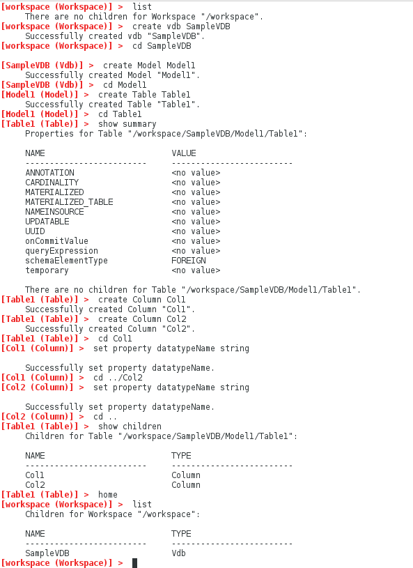

### Overview

This article shows how to use the VDB Builder cli to create a new dynamic VDB interactively.

### Requirements

* VDB Builder cli installed - refer to the [installation instructions](install-cli.md) for details

### Interactive VDB creation

Once you have launched the VDB Builder cli, it's easy to create a VDB.  The sample session below shows an example of creation of a very simple VDB.

Here is a summary of the session commands:
* __list__ - shows all children at the cli context.  Our workspace initially contains no children.
* __create vdb SampleVDB__ - create a VDB named __SampleVDB__
* __cd SampleVDB__ - 'navigates' down into the __SampleVDB__ 
* __create Model Model1__ - create a Model named __Model1__ in the VDB
* __cd Model1__ - navigate into the Model1 cli context
* __create Table Table1__ - create a Table named __Table1__ within Model1
* __cd Table1__ - navigate into the Table1 cli context
* __show summary__ - shows a summary of the current cli context, in this case __Table1__.  Show summary will show the object properties, as well as its children.
* __create Column Col1__ - create Column named __Col1__ within Table1
* __create Column Col2__ - create Column named __Col2__ within Table1
* __cd Col1__ - navigates into Column __Col1__
* __set property datatypeName string__ sets __Col1__ datatype to __string__
* __cd ../Col2__ - navigates up a level, then down into Column __Col2__
* __set property datatypeName string__ sets __Col2__ datatype to __string__
* __cd ..__ - navigates up one level
* __show children__ - show the children of the current context __Table1__.  Notice the child columns we created.
* __home__ - navigates to the __workspace__ root context.
* __list__ - list the workspace children - it now contains our __SampleVDB__!

