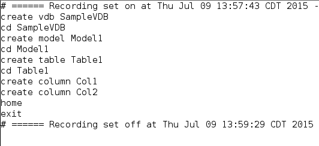
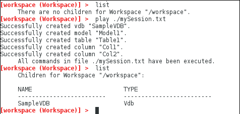
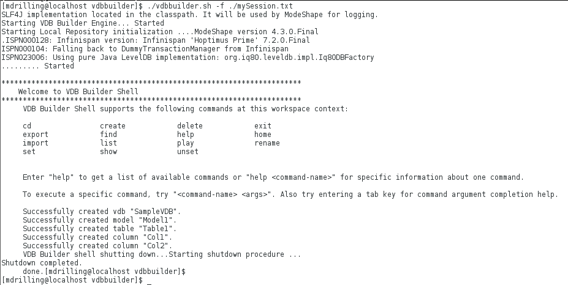

### Overview

This article shows how to use the VDB Builder cli to execute a previously saved session command file.  You can create or edit existing command files to fully script the construction of your VDBs!  Use this sample as a starting point for working with your own VDBS.

Remember, you can use __tab completion__ to see the available commands and sub-command options, or use __help command__ to see command details.

### Requirements

* VDB Builder cli installed - refer to the [Installation Instructions](install-cli.md) for details

### Execute a command file

The image below shows our command file (mySession.txt).

---
To execute the command file, you have 2 options:

#### Play file in interactive mode.  
Below is a session that shows the playback in interactive mode.  __(Do not add `exit` at end of script file)__

#### Execute the file from command line 
You can execute the file from the VDB Builder launch command, using the __-f__ option, as shown below.  __(Add `exit` at end of script file)__

