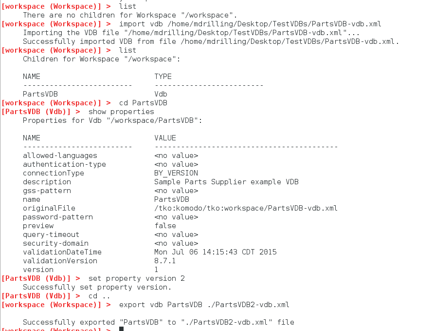
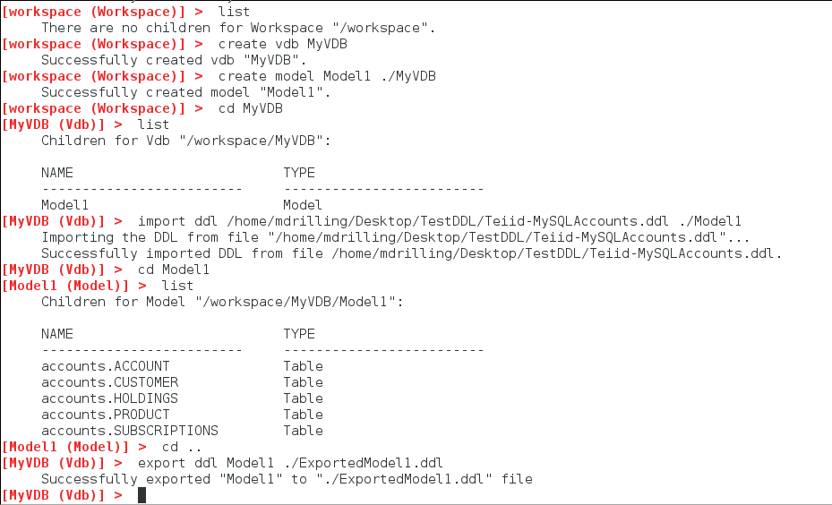

### Import and Export VDBs and DDL

These samples show how to use the VDB Builder cli to import and export VDBs and DDL interactively.  Use this sample as a starting point for working with your own VDBs and DDL.

Remember, you can use __tab completion__ to see the available commands and sub-command options, or use __help__ to see command details.

### Requirements

* Install VDB Builder cli - refer to the [Installation Instructions](install-cli.md) for details

### Import and Export VDBs

The sample session below shows how to import and export a dynamic VDB.  The session shows import of __PartsVDB-vdb.xml__ , set property to change the VDB version, then export of the VDB into a different dynamic VDB file.

---
* __`import vdb <vdbFile> [parentObject]`__ - imports VDB from __"vdbFile"__ into the workspace
* __`export vdb PartsVDB <vdbFile>`__ - exports __PartsVDB__ to the specified file __"vdbFile"__
---

### Import and Export DDL

The sample session below shows how to import and export DDL.  The session shows creation of a VDB with Model1, then import of __Teiid-MySQLAccounts.ddl__ to create the Model1 content, then export of the model contents into a different DDL file.

---
* __`import ddl <ddlFile> [parentObject]`__ - imports DDL from __ddlFile__ into __"parentObject"__
* __`export ddl Model1 <ddlFile>`__ - exports __Model1__ content to a DDL file __"ddlFile"__
---

