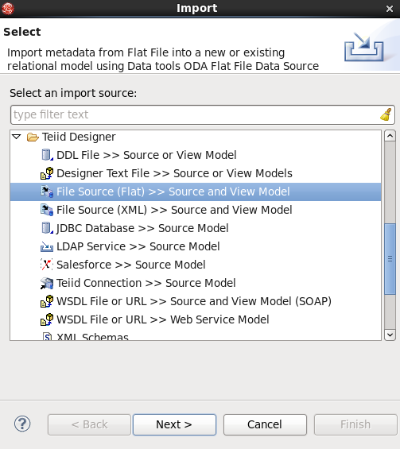

# What's this

The Import Wizard provides a means to create a model based on the structure of a data source, to convert existing metadata (that is, WSDL or XML Schema) into a source model or to load existing metadata files into the current VDB.

To launch the Import Wizard, select the **File -> Import -> Teiid Designer** action or select a project, folder or model in the tree and right-click select **Import... -> Teiid Designer**

This project contain a series samples for demonstrating how to use Import Wizard convert existing metadata into a source model, the examples contain:

[Import From DDL](import-from-ddl.md)

[Import From Designer Text File](import-from-designer-text-file.md)

[Import From Flat File Source](import-from-flat-file-source.md)

[Import From XML File Source](import-from-xml-file-source.md)

[Import From JDBC Database](import-from-jdbc-database.md)

[Import From LDAP Service](import-from-ldap-service.md)

[Import From Salesforce](import-from-salesforce.md)

[Import From Teiid Connection](import-from-teiid-connection.md)

[Import WSDL into Relational Models](import-wsdl-into-relational-models.md)

[Import WSDL Into Web Service](import-wsdl-into-webservice.md)

[Import XML Schemas](import-xml-schemas.md)
