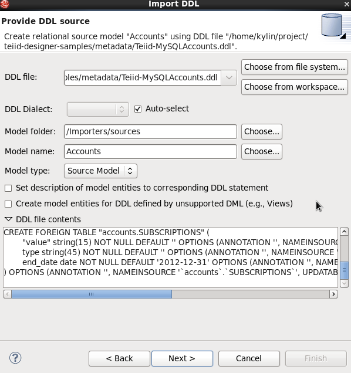
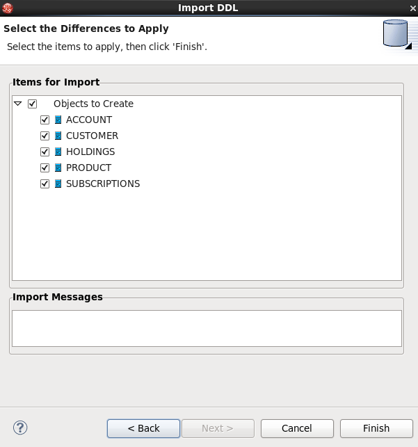

# Overview

This article presents the ability of Teiid Designer to import from DDL.

# Requirements

* JBoss Data Virtualization 6.x installed and configured correctly, refer to [document](../installation/jdv-installation.md) for details
* JBoss Developer Studio 7.x with JBoss Data Virtualization Development Tools installed and configured correctly, refer to [document](../installation/jdv-installation.md) for details

# Preparing the Data

The data sources to be used consist of the following:

* [Teiid-MySQLAccounts.ddl](../metadata/Teiid-MySQLAccounts.ddl)

The files should be copied to a location where both are accessible by the Teiid installation, eg. /usr/share/teiid.

# Import Procedure 

* On the Import Wizard select **DDL File >> Source or View Model** and click **Next>**

* In **Provide DDL source** page, select the DDL file, Set the Model folder location, enter or select valid model name, set Model type (Source Model or View Model), set desired options and click **NEXT >**

* In **Select the Differences to Apply** page, a difference report is presented for viewing or deselecting individual relational entities. Click **Finish** to complete.

> Note, **Modeling -> Set Connection Profile** is necessary for Preview Data

# Test
