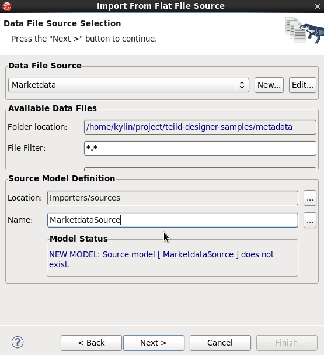
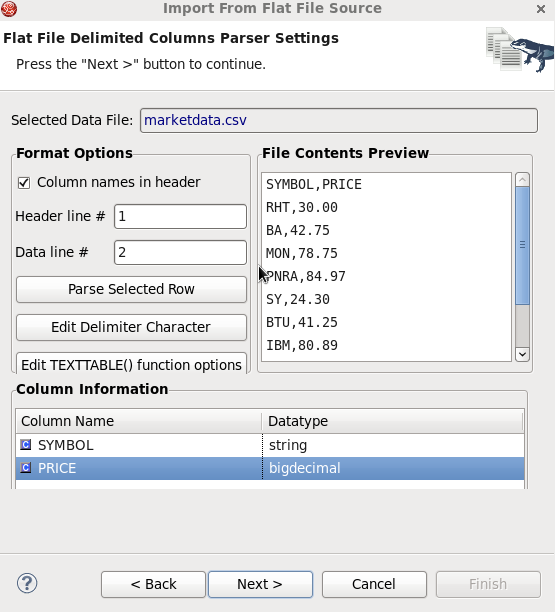
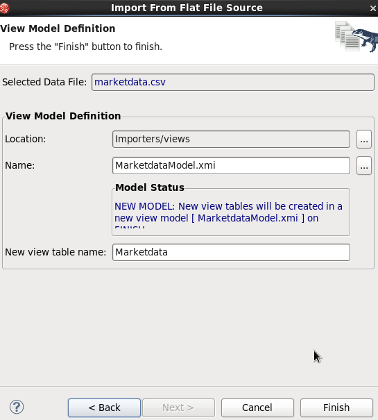

# Overview

This article presents the ability of Teiid Designer to import From Flat File Source.

After import From Flat File Source, it will include a source model containing the **getTextFiles()** procedures supported by **JBoss Data Virtualization**.

The importer will also create a new view model containing a view table for your selected flat file source file. Within the view table will be generated SQL transformation containing the **getTextFiles()** procedure from your source model as well as the column definitions and parameters required for the Teiid **TEXTTABLE()** function used to query the data file. You can also choose to update an existing view model instead of creating a new view model.

# Requirements

* JBoss Data Virtualization 6.x installed and configured correctly, refer to [document](../installation/jdv-installation.md) for details
* JBoss Developer Studio 7.x with JBoss Data Virtualization Development Tools installed and configured correctly, refer to [document](../installation/jdv-installation.md) for details

# Preparing the Data

The data sources to be fused consist of the following:

* [marketdata.csv](../metadata/marketdata.csv)

The file should be copied to a location where both are accessible by the Teiid installation, eg. /usr/share/teiid.

# Import Procedure 

* On the Import Wizard select **File Source (Flat) >> Source and View Model** and click **Next>**

* In **File Import File Options** page select *Flat file on local file system*, click **Next>**

* In **Data File Source Selection** page click **New...** button create *Marketdata* connection profile point to [marketdata.csv](../metadata/marketdata.csv) file, file name **MarketdataModel** as source model, select a location as below:

* Click **Next>** in **Flat File Column Format Definition** page to define the format of column data in the file. The options are **Character delimited** and **Fixed width**. This page contains a preview of the contents of your file to aid in determining the format. The wizard defaults to displaying the first 20 lines, When finished with this page, click **Next>**.

* In **Flat File Delimited Columns Parser Settings** page change the *PRICE* datatype to bigdecimal

* Click **Next>** in **View Model Definition** page, select the view model location, name and table name as below, click "Finish"

# Test

* The view tables containing the completed transformation SQL:

~~~
SELECT
    A.SYMBOL, A.PRICE
  FROM
    (EXEC MarketdataSource.getTextFiles('marketdata.csv')) AS f, TEXTTABLE(f.file COLUMNS SYMBOL string, PRICE bigdecimal HEADER) AS A
~~~

* Select table `Marketdata` execute Preview Data, the [marketdata.csv](../metadata/marketdata.csv) will diplay in SQL Results.

* Create VDB `Marketdata.vdb` with `MarketdataModel.xml`, deploy it to VDB, run [MarketdataClient](../jdbc-client/src/main/java/com/jboss/teiid/client/MarketdataClient.java) as java application, it should have the following output:

~~~
Query SQL: SELECT * FROM Marketdata
1: RHT, 30.00
2: BA, 42.75
3: MON, 78.75
4: PNRA, 84.97
5: SY, 24.30
6: BTU, 41.25
7: IBM, 80.89
8: DELL, 10.75
9: HPQ, 31.52
10: GE, 16.45
~~~ 
