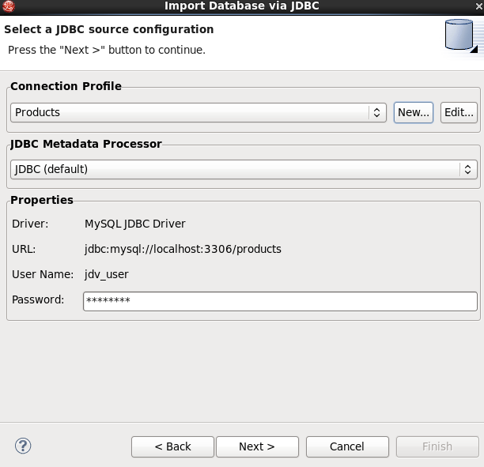
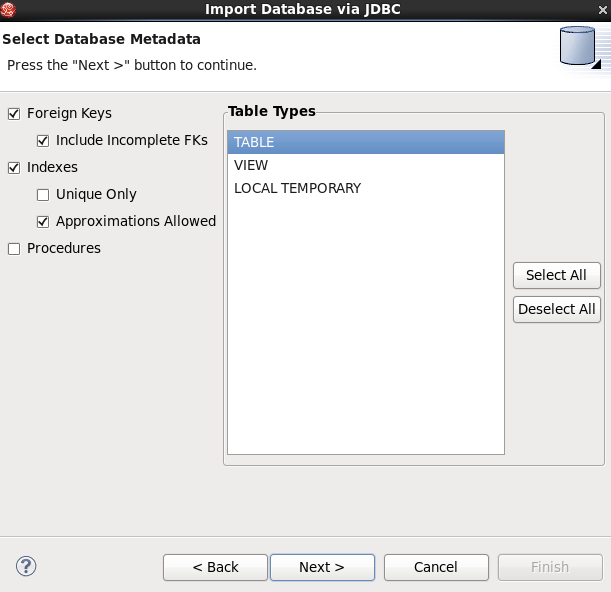
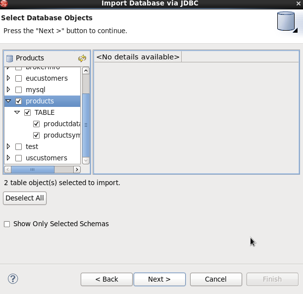

# Overview

This article presents the ability of Teiid Designer to import

# Requirements

* JBoss Data Virtualization 6.x installed and configured correctly, refer to [document](../installation/jdv-installation.md) for details
* JBoss Developer Studio 7.x with JBoss Data Virtualization Development Tools installed and configured correctly, refer to [document](../installation/jdv-installation.md) for details
* Mysql Database 

# Preparing the Data

The data sources to be used consist of the following:

* [financials-mysql.sql](financials-mysql.sql)

[financials-mysql.sql](financials-mysql.sql) need to be imported to database, refer to [../metadata/mysql-usage-scripts.md](../metadata/mysql-usage-scripts.md) for details.

# Import Procedure 

* In Import Wizard select **JDBC Database >> Source Model** and click **Next>**

* In **Select a JDBC source configuration** panel, click **New...** to create mysql connection profile `Products`, note that, this profile point to `products` use the following parameters

| *Datanase* | *URL* | *Username* | *Password* |
|------------|-------|------------|------------|
|products |jdbc:mysql://localhost:3306/products |jdv_user |jdv_pass |

After completing the connection profile creation the **Select a JDBC source configuration** panel looks like:

Click **Next>** to continue

* On the **Select Database Metadata** page, select the types of objects in the database to import. 

* Click **Next>** in **Select Database Object** page select `products`

* Click "Next>" in **Specify Import Options** page select a folder, click **Finish**

# Test

Select one of Table from `products` Preview Data, the database data will display in SQL Results.
