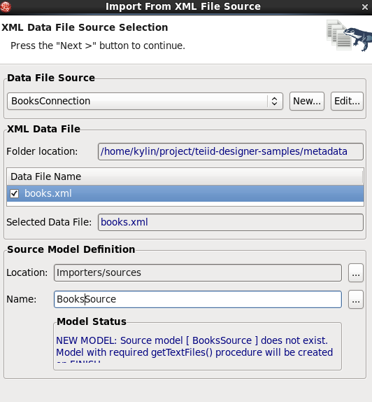
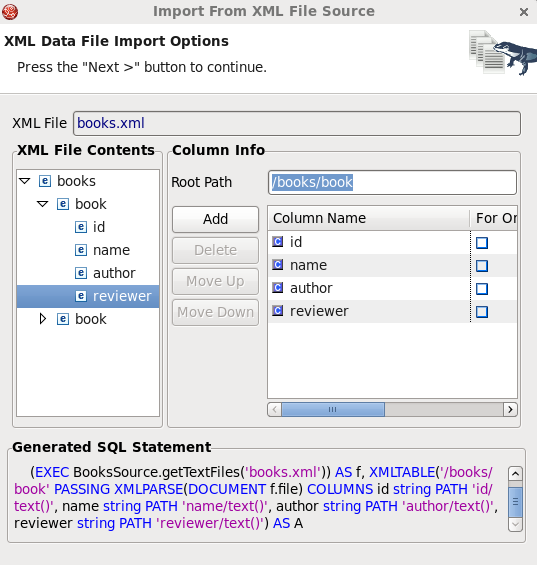
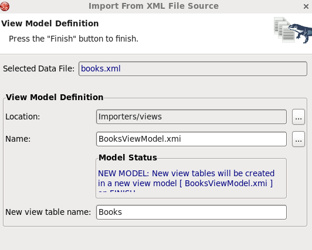

# Overview

This article presents the ability of Teiid Designer to import XML Data File Source.

The importer will include a source model containing the **getTextFiles()** procedure or **invokeHTTP()** procedure which are both supported by JBoss Data Virtualization.

The importer will also create a new view model containing a view table for your selected flat file source file. Within the view table will be generated SQL transformation containing the **getTextFiles()** procedure from your source model as well as the column definitions and parameters required for the Teiid **XMLTABLE()** function used to query the data file.

The **XMLTABLE** function uses XQuery to produce tabular output. The **XMLTABLE** function is implicitly a nested table and may be correlated to preceding FROM clause entries. **XMLTABLE** is part of the SQL/XML 2006 specification.

# Requirements

* JBoss Data Virtualization 6.x installed and configured correctly, refer to [document](../installation/jdv-installation.md) for details
* JBoss Developer Studio 7.x with JBoss Data Virtualization Development Tools installed and configured correctly, refer to [document](../installation/jdv-installation.md) for details

# Preparing the Data

The data sources to be fused consist of the following:

* [book.xml](../metadata/books.xml)

The files should be copied to a location where both are accessible by the Teiid installation, eg. /usr/share/teiid.

# Import Procedure

* On the Import Wizard select **File Source (XML) >> Source and View Model** and click **Next>**

* In **XML Import File Options** page select *XML file on local file system*, click **Next>**

* In **XML File Source Selection** page click **New...** button create **BooksConnection** connection profile point to [book.xml](../metadata/books.xml) file, file name **BooksSource** as source model, select a location as below: 

* Click **Next>** in **XML Data File Import Options** page, select `/books/book` as Root Path, `id`, `name`, `author`, `reviewer` as Column Name as below:

> Note the generated SQL Statement as below:

~~~
SELECT 
    A.id AS id, A.name AS name, A.author AS author, A.reviewer AS reviewer
  FROM
    (EXEC BooksSource.getTextFiles('books.xml')) AS f, XMLTABLE('/books/book' PASSING XMLPARSE(DOCUMENT f.file) COLUMNS id string PATH 'id/text()', name string PATH 'name/text()', author string PATH 'author/text()', reviewer string PATH 'reviewer/text()') AS A
~~~

* Click **Next>**, in **View Model Definition** page select Location, Name and New view table name as below:

# Test

* Select table `Books` execute Preview Data, the data in [book.xml](../metadata/books.xml) will diplay in SQL Results.

* Create VDB `Books.vdb` with BooksViewModel.xml, deploy it to JDV, run [BooksClient](../jdbc-client/src/main/java/com/jboss/teiid/client/BooksClient.java) as java application, it should have the following output:

~~~
Query SQL: SELECT * FROM Books
1: 100, WildFly Performance Tuning, Arnold Johansson, Kylin Soong
2: 101, JBoss EAP6 High Availability, Weinan Li, Rick Wagner
~~~
