# What's this?

This document supply a guide for how to install Red Hat JBoss Developer Studio and the tools for creating data views that are accessible through standard protocols (the Teiid Designer plug-in for Red Hat JBoss Developer Studio (JBDS) and connect Red Hat JBoss Developer Studio to the Red Hat JBoss Data Virtualization server.

# Installing Red Hat JBoss Developer Studio

Download JBoss Developer Studio from https://www.jboss.org/products/jbds.html by clicking the green download button.

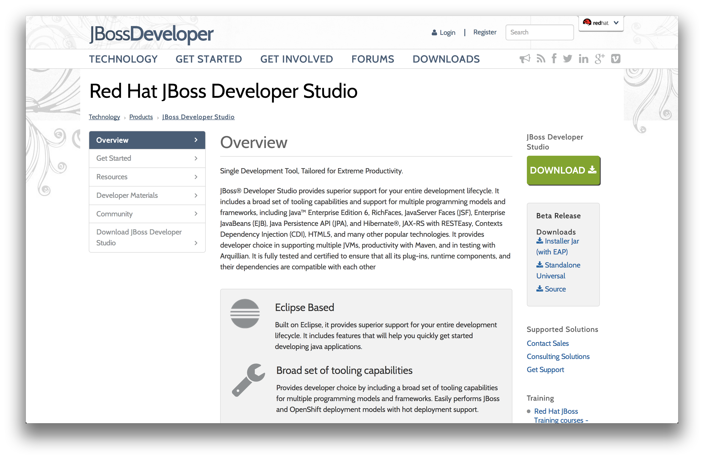

Run the JBDS installer using java at the command prompt: java -jar {jbdevstudioinstaller.jar} The current available version is 7.1.1.GA, and to run the installer at the command prompt see below.

~~~
java -jar jbdevstudio-product-universal-7.1.1.GA-v20140314-2145-B688.jar
~~~

Follow the installer prompts to complete the installation process.

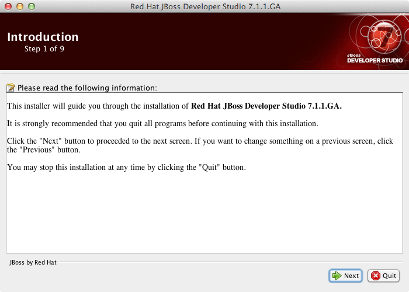

When the Installer window opens, click Next.

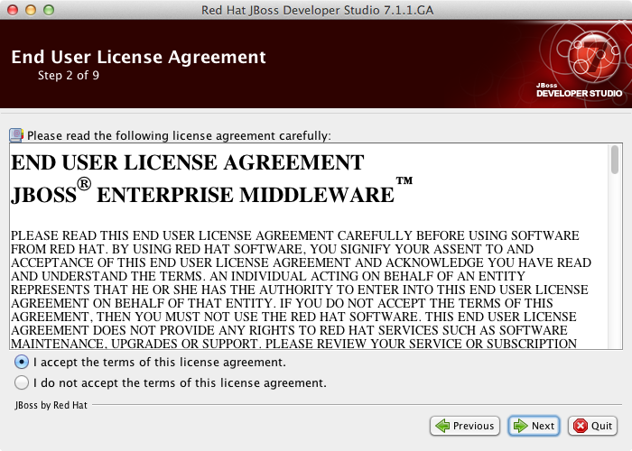

After reading and agreeing to the terms of the End User License Agreement, select I accept the terms of this license agreement and click Next.

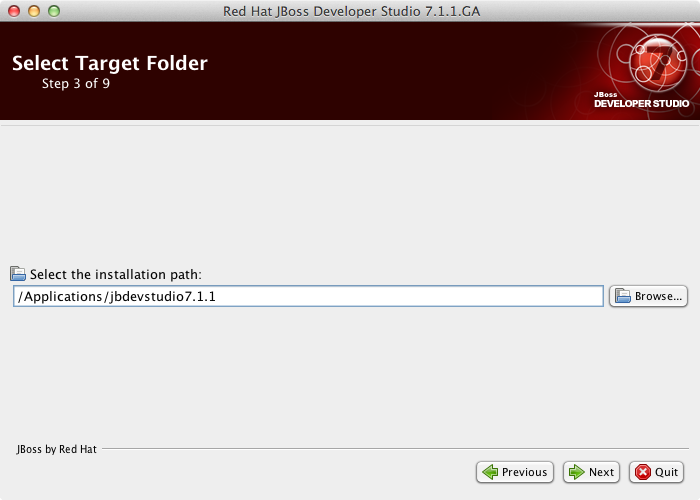

In the Select the installation path field, type the path where you want Red Hat JBoss Developer Studio to be installed or click Browse to navigate to the location. When the Select the installation path field shows the correct path, click Next.

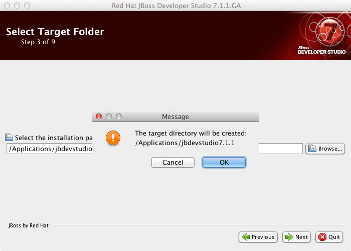

When you are prompted about the specified location being created or overwritten, review the message and, if satisfied, click OK to proceed and click Next to continue.

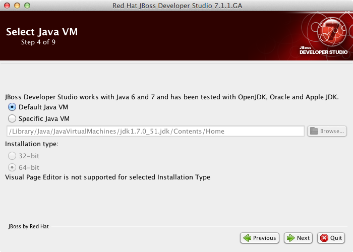

In the Select Java VM step, Default Java VM is automatically selected. Ensure that the disabled text field contains the path of the Java developer kit you want to use. This is based on the default Java developer kit of your system. To change the specified Java developer kit, select Specific Java VM and type the path of the Java developer kit in the text field or use the Browse button to locate the Java developer kit. When the text field shows the correct Java developer kit path, click Next.

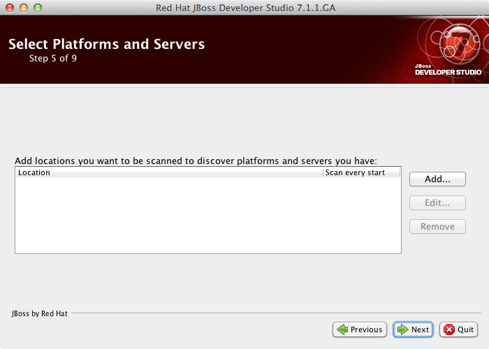

In the Select Platforms and Servers step one can add server to make use of automatic runtime detection for finding already installed application servers. Skip this for now since we will add servers later. Click Next to proceed.

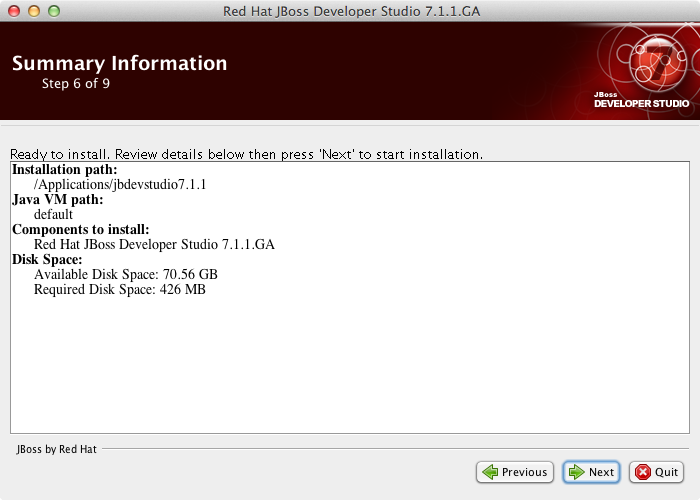

Review the details in the Summary Information window and, if they are correct, click Next. The installation commences.

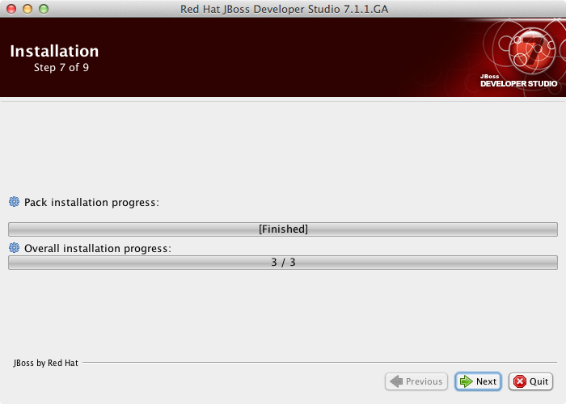

When the installation progress bar shows Finished, click Next. The installation process is now complete.

To create shortcuts for starting JBoss Developer Studio, select the Create shortcuts in the Start-Menu and Create additional shortcut on the desktop check boxes and click Next. To automatically start JBoss Developer Studio when the Installer window closes, select the Run JBoss Developer Studio after installation check box.

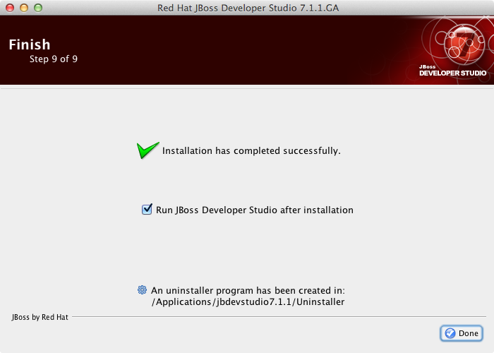

Click Done to close the Installer window.

When the installation is completed, run Red Hat JBoss Developer Studio 7.1.1. When the Red Hat JBoss Developer Studio starts, you are asked to choose the workspace
folder for the session. The workspace is where your projects are stored.

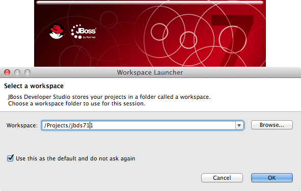

To set the workspace location, follow these steps:

* In the Workspace field, type the path for a new or existing workspace or use Browse to navigate to the workspace location.
* If you do not want to be asked to choose a workspace folder each time the IDE starts, select the Use this as the default and do not ask again check box.
* Click OK.

The workspace location prompting behavior can be altered at any time by clicking Window → Preferences. Expand General → Startup and Shutdown → Workspace.
Select or clear the Prompt for workspace on startup check box to alter the behavior as appropriate.

# Installing Teiid Designer plug-in for Red Hat JBoss Developer Studio

From the JBDS menu bar, choose Help → Install New Software…

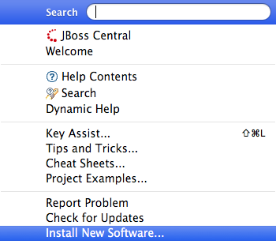

In the "Work with:" field on the Install wizard, paste the following link:
   http://download.jboss.org/jbosstools/updates/stable/kepler/integration-stack/

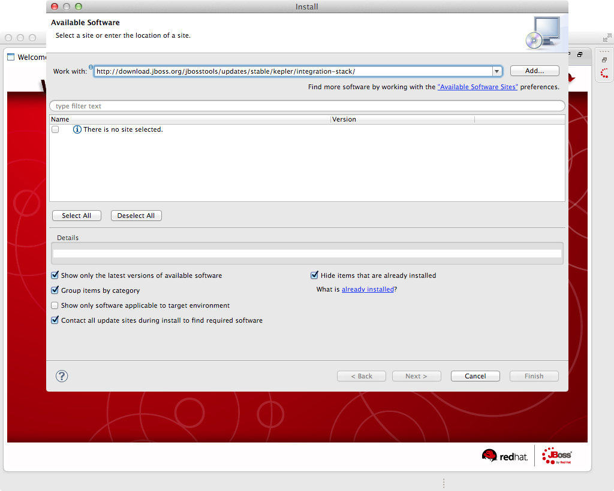

Click the Add… button.

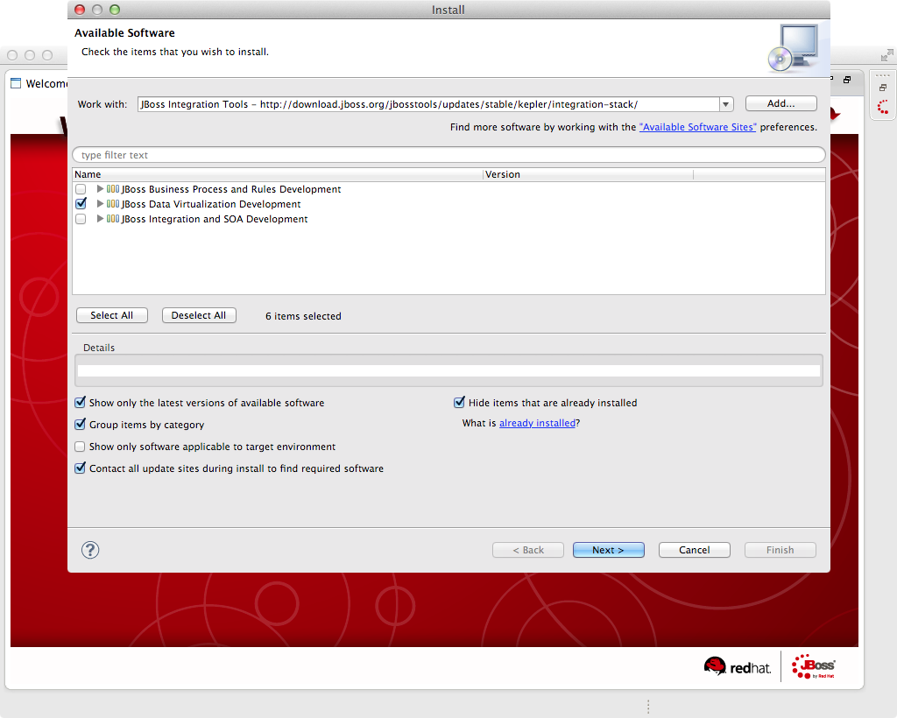

Select JBoss Data Virtualization Development option in the list and click Next.

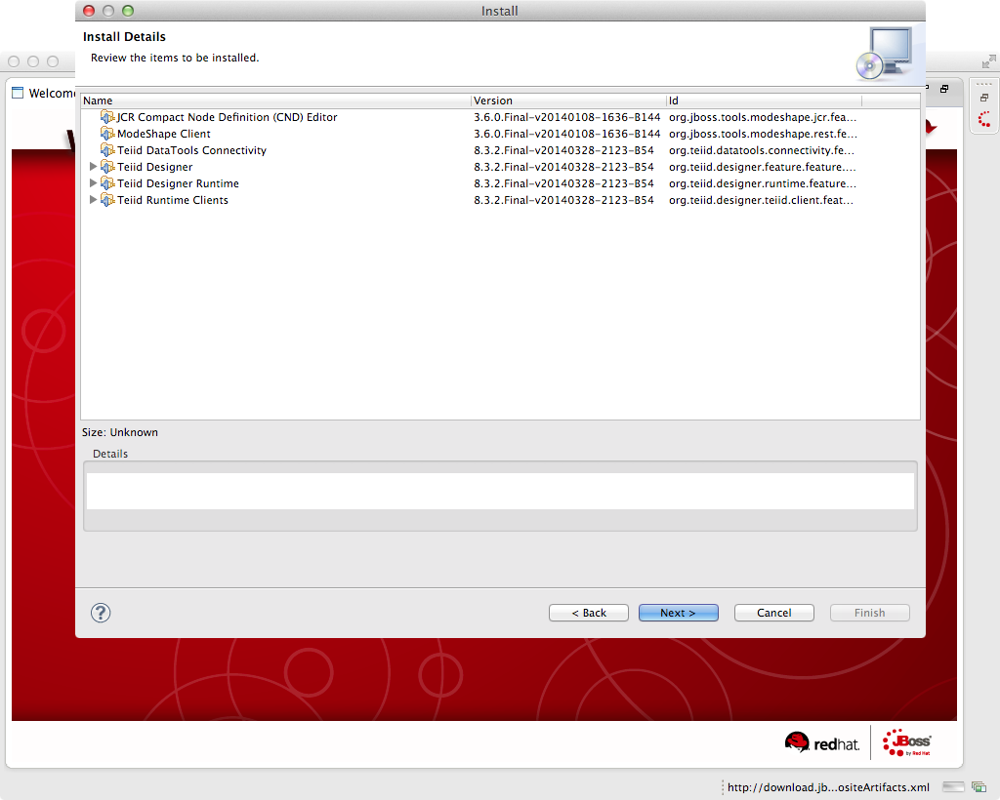

Review Install Details and click the Next > button.

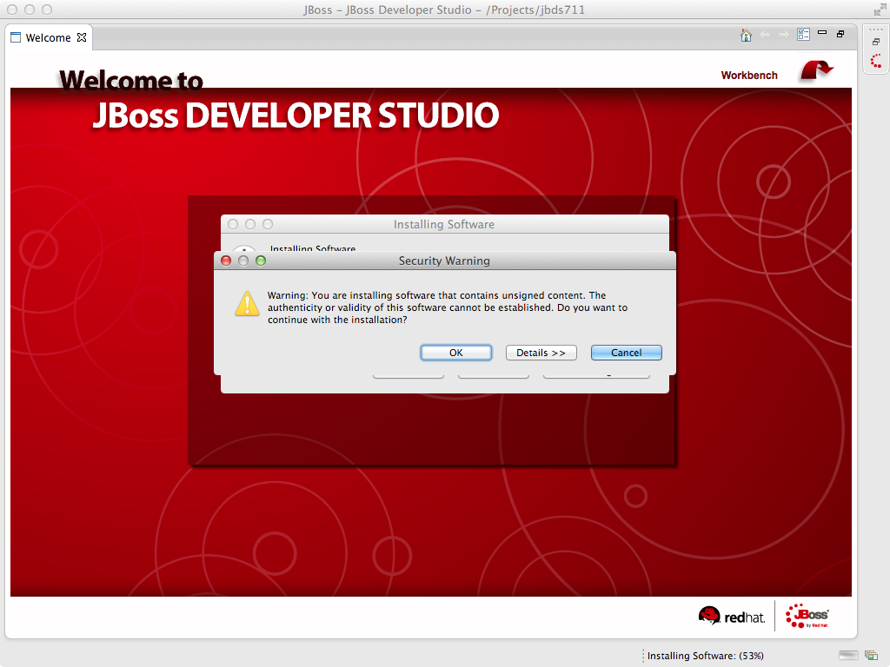

The Security Warning window appears and click the OK button to proceed.

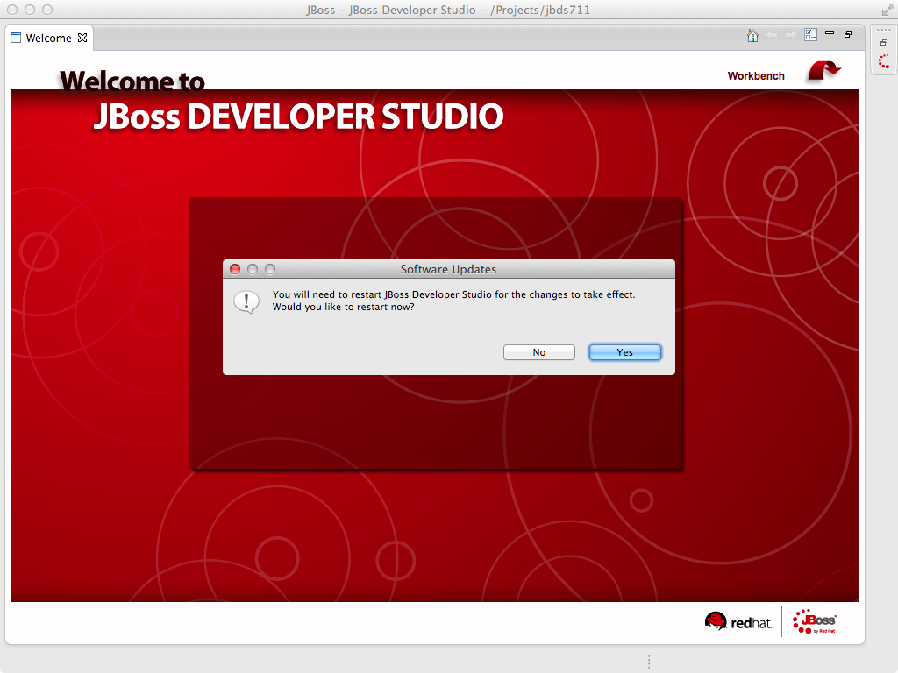

The Software Updates window appears. Press the Yes button to restart Red Hat JBoss Developer Studio to apply the changes to take effect.

Now that you have JBoss Data Virtualization and JBoss Developer Studio successfully installed, it is time to “hook up” JBoss Developer Studio to the JBoss Data Virtualization server instance.

# Connect Red Hat JBoss Developer Studio to the Red Hat JBoss Data Virtualization server

If the Servers pane is not already visible in JBoss Developer Studio, you can open it by Window → Show View → Other → Server → Servers. The Show View window is presented below.

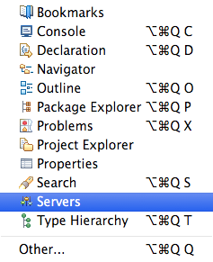

Now, click the OK button. The Servers pane will now be visible in the lower portion of JBoss Developer Studio and is displayed below.

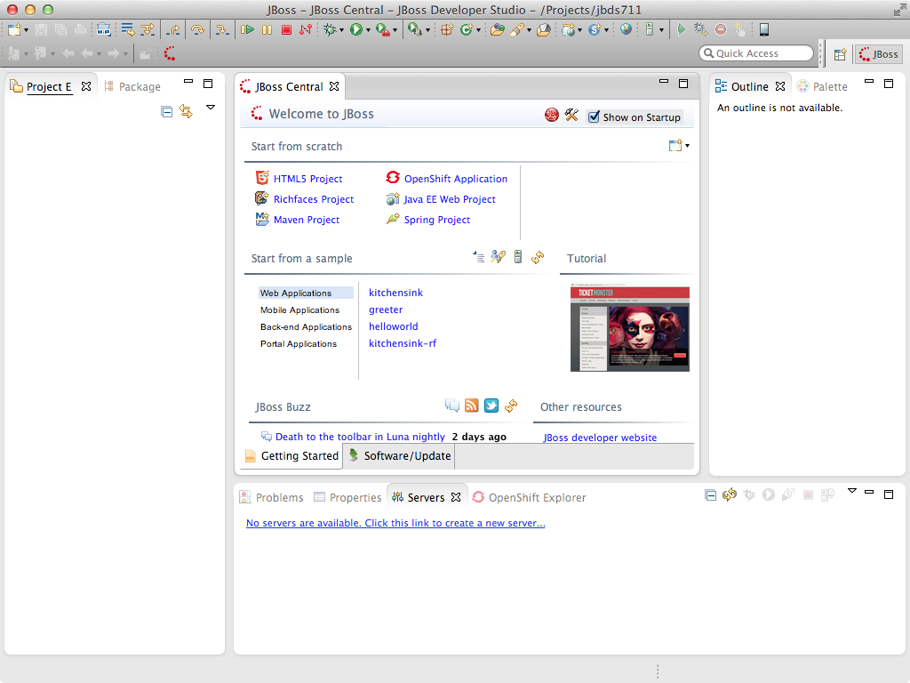

Now, it is a matter of clicking through several screens to add the JBoss Data Virtualization server instance that was installed as Part of [JBoss Data Virtualization Installation](jdv-installation.md). Click the link “No servers are available. Click this link to create a new server…” and following window will appear:

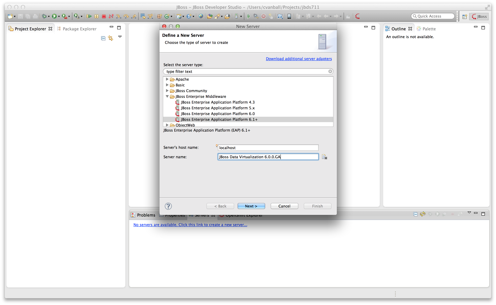

With the New Server wizard enabled, be sure you entries look like those above. Select JBoss Enterprise Middleware → JBoss Enterprise Application Platform 6.1+ as the
server type. You can keep the defaults that are selected or enter the values appropriate for your workstation. In this case, “localhost” is entered for Server’s host name and “JBoss EAP 6.1+ Runtime Server” is entered for the Server name. Change the Server name into a meaningful name. Click the Next button. Next, the JBoss Runtime will need to be defined. Essentially, this is selecting the “home” directory for the JBoss Data Virtualization instance that was installed as part of  [JBoss Data Virtualization Installation](jdv-installation.md). The values to select are illustrated below. Select the “home” directory for the JBoss Data Virtualization instance. This will be <path to installed instance>/jboss-eap-6.1. Once this runtime is selected, the available configurations are available. To keep things simple, select the “default” profile.

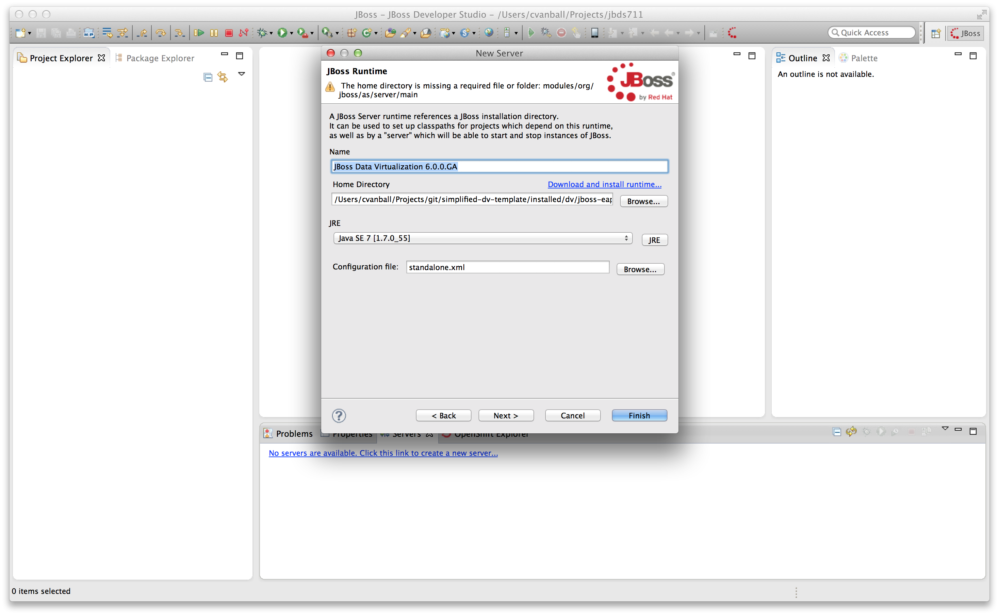

Click Finish.

The Servers pane will now have the available server available as indicated below.

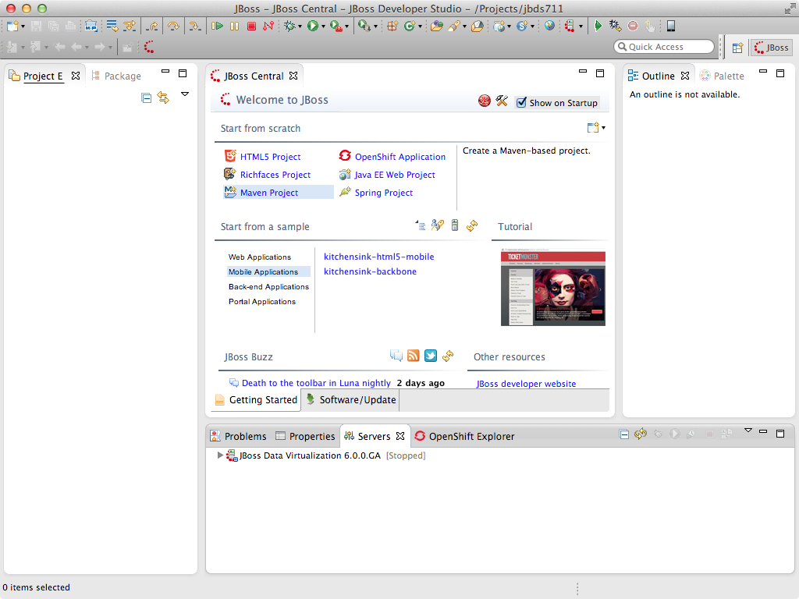

At this point, you can right-click on the server and there is a list of available options. Click Start from the available options and the server will start up.

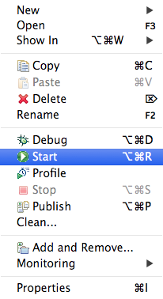

> If JBoss Data Virtualization Server is already started from the command line using standalone.sh or standalone.bat, JBoss Developer Studio will show a warning "Server already running on localhost", select option "Set the server adapter to started, without launching a new server."

After JBoss Data Virtualization Server start up finished, it looks like as below figure.

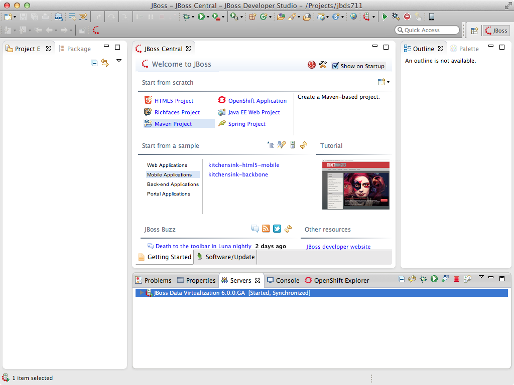

Now JBoss Data Virtualization instance is running, we will go ahead make sure JBDS is connected to the JBoss Data Virtualization server.

# Open the Teiid Perspective and connect to a running Server instance

Launch JBDS (if it is not already open), and open the “Teiid Designer” perspective. This is because the JBoss perspective is the default perspective. To open the “Teiid Designer” perspective, first select Window → Open Perspective → Other… in order for the full list of perspectives to be displayed and the “Teiid Designer” perspective to be selectable.

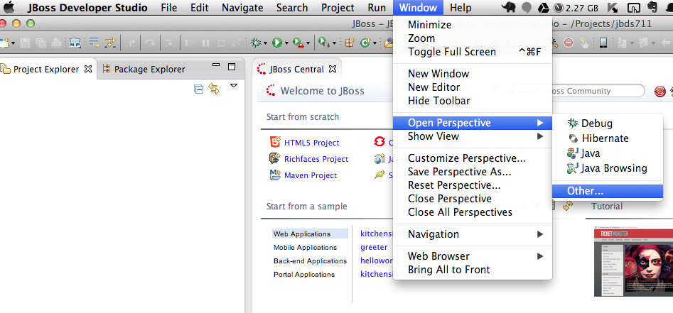

Select Teiid Designer from the perspective list as shown below.

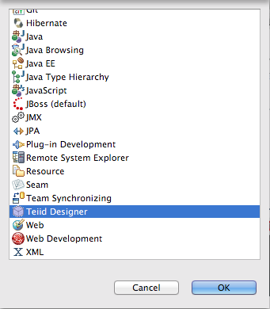

Click OK. This will bring you to a screen that looks like this:

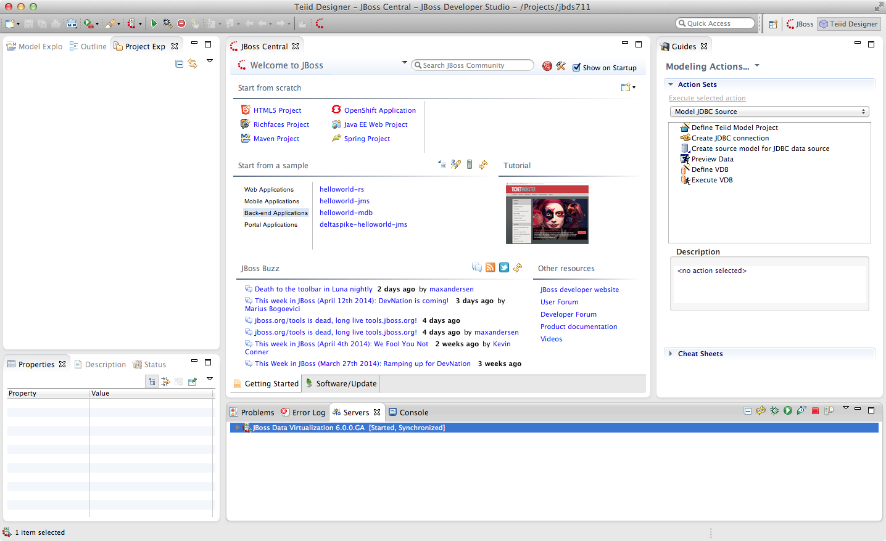

Connecting to a running Server instance is necessary to execute previews of the data services that we will create. In the Teiid Guides window select Teiid. Select the option "Set the Default JBoss / Teiid instance" and double-click on the JBoss Data Virtualization 6.0.0.GA server in the Server pane. For the name simply enter “MyTeiidInstance”. For the Teiid JDBC Connection Info, enter “localhost” for the host and enter `user/user` for the username/password. Keep the default port number. Also, be sure that the “Save” checkbox is marked. The “SSL” box should not be marked. For the Teiid Admin Connection Info, keep the defaults that are listed and use `admin/admin` for the username/password combination. Keep the default port number. Both “Save” and “SSL” checkboxes should be checked. When complete, your Teiid Server Connection Information should look like the illustration below. As a “sanity” check, be sure to click the Test button. You should get a "OK" message.

The Teiid View along the bottom of JBDS should look like the following illustration.

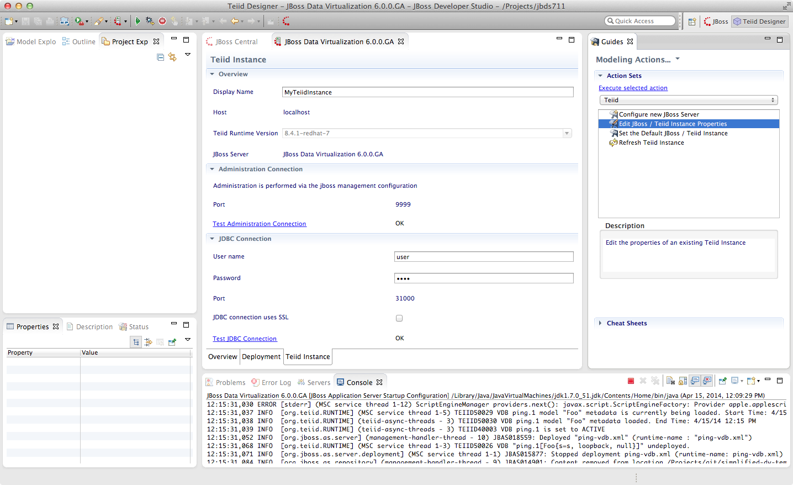
