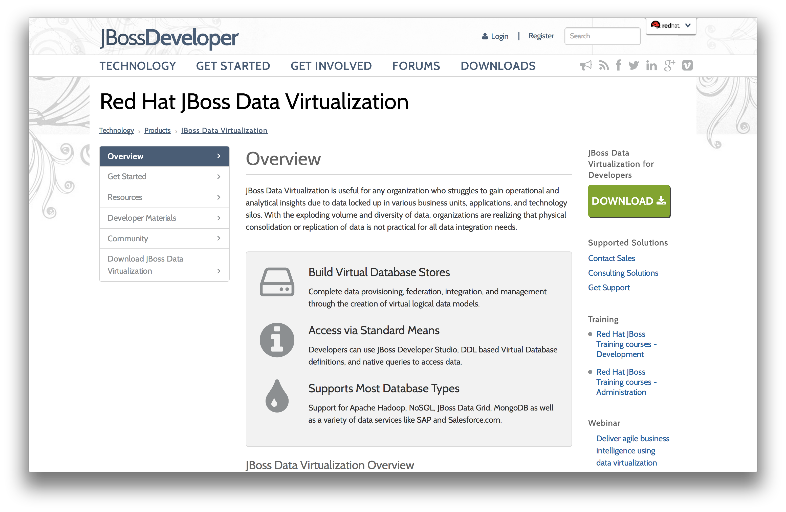
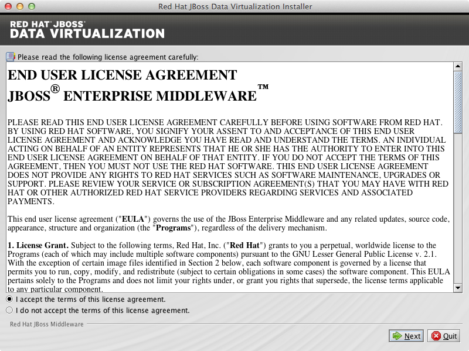
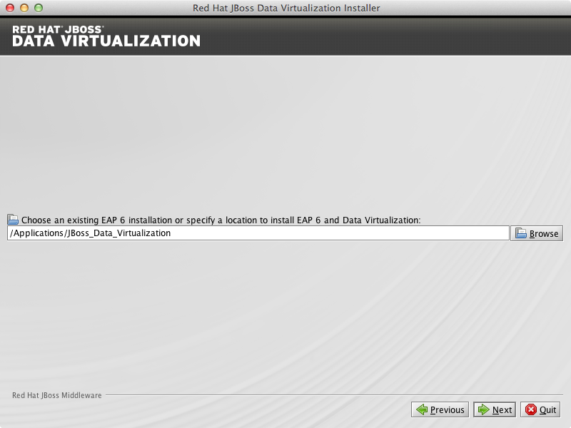
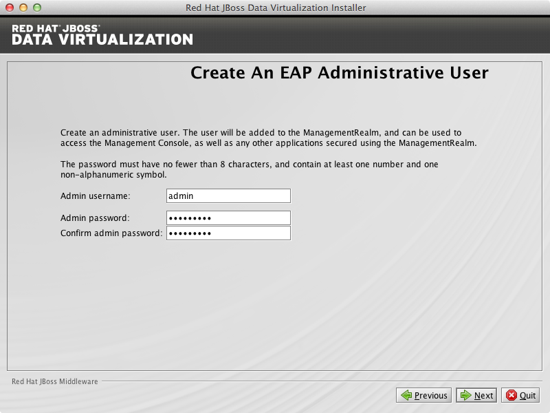
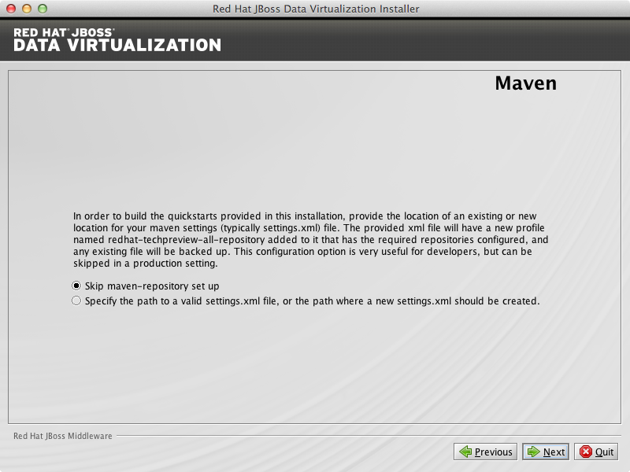
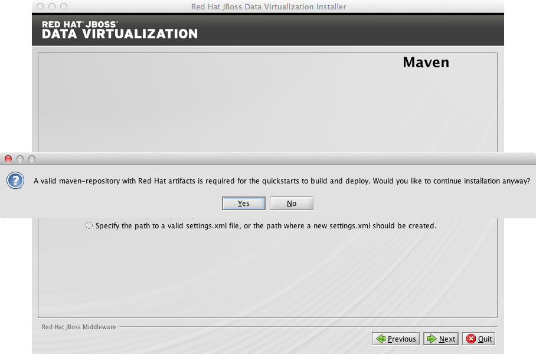
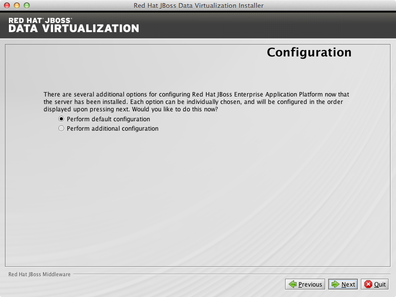
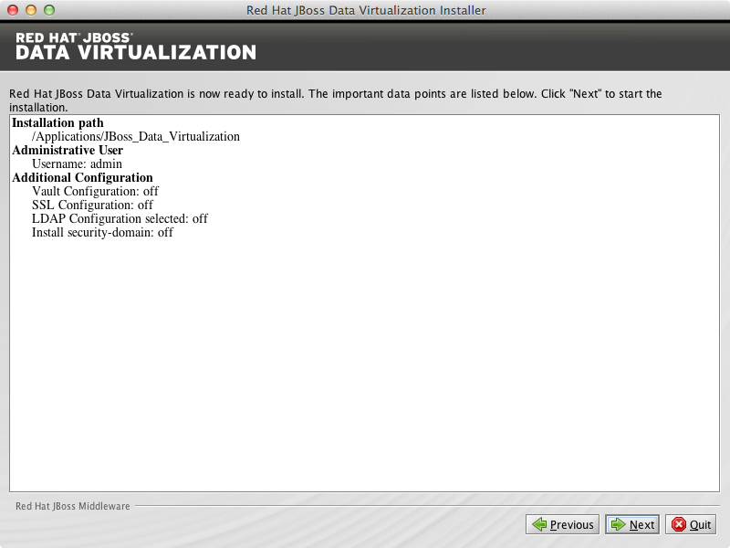
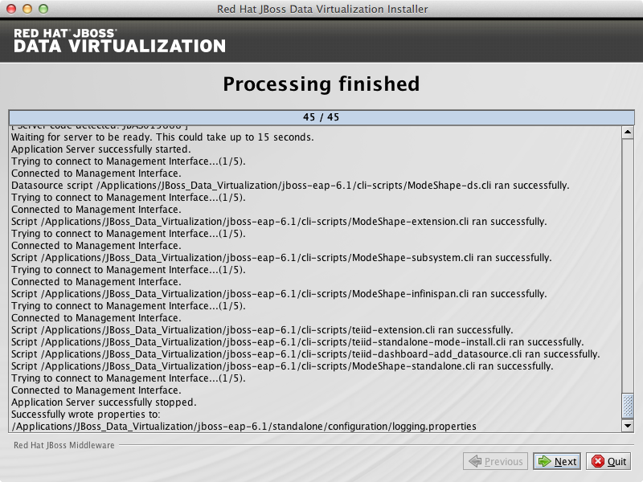
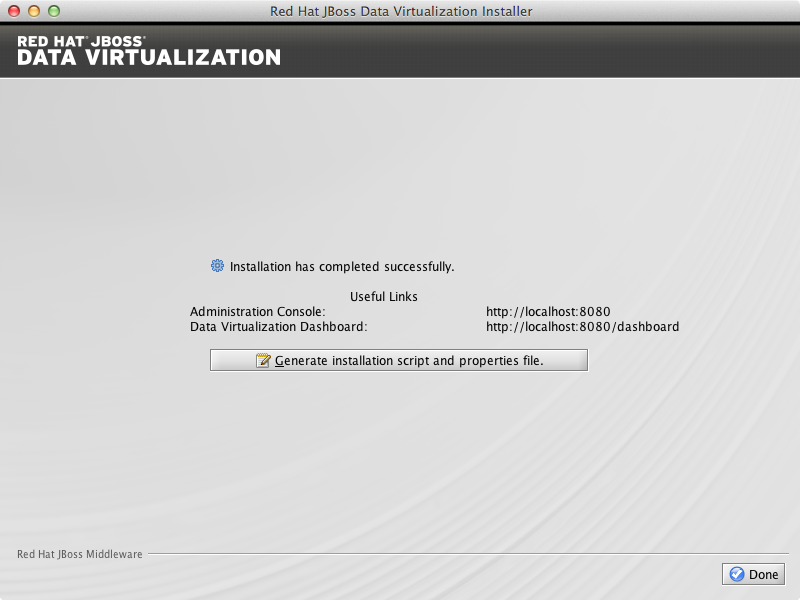

# What's this?

Primary purpose of this document is supply a step by step precedures for installing Red Hat JBoss Data Virtualization. The potential readers for this document should be Community Developer, JBoss Data Virtualization Starter, all download image come from [JBoss Community](http://jboss.org/).

We can use Graphical mode launches a graphical wizard which provides step-by-step instructions for installing and configuring the Red Hat JBoss Data Virtualization. Additional setup, including the Quickstarts and Maven Repository, is also possible with the installer.

# Installing Red Hat JBoss Data Virtualization through graphical mode

Download the Red Hat JBoss Data Virtualization installer binary by clicking the green download button at http://www.jboss.org/products/datavirt.html.

Open a terminal window and navigate to the location where the GUI installer was downloaded. Run the installer using java at the command prompt: `java -jar jboss-dvinstaller-{version}.jar`. The current available version is 6.0.0.GA-redhat-4 and to run the installer at the command prompt see below:

~~~
java -jar jboss-dv-installer-6.0.0.GA-redhat-4.jar
~~~

A dialogue box will open followed by the End User License Agreement. If you accept the terms of the agreement, select I accept the terms of this license agreement and then click Next.

A filepath confirmation dialogue box will appear. In the Select the installation path field, type the path where you want JBoss Data Virtualization to be installed or click Browse to navigate to the desired location. When the Select the installation path field shows the correct path, click Next.

When you are prompted about the specified location being created or overwritten, review the message and, if satisfied, click OK and then press Next.

You will be prompted to create a new admin username and password. Once created, it will be added to the ManagementRealm and can be used to access the Management Console and other applications secured using the ManagementRealm. Enter the new username and password in the appropriate fields and click Next.

The Maven Repository Setup window appears. You will need to provide Maven repository settings in order to build quickstarts provided in the Red Hat JBoss Data Virtualization installation. At this point, the installer can automatically configure your Maven settings to setup the online repository for remote access. To setup the Maven repository, select Specify the path (or URL)…. Enter the location of the Maven settings.xml file or select Browse to navigate to the file. Alternatively, you can choose to skip the Maven repository setup.

Skip maven-repository set up for now. Click Next to proceed.

Click Yes to proceed.

You can install Red Hat JBoss Data Virtualization either with default configuration or with additional configuration options. Select option Perform default configuration. Click Next to proceed.

A summary of the installation will be displayed, see below.

Click Next for the installation to commence. This may take a minute.

Once all the components are installed, click Next.

Click Generate installation script and properties file if you wish to generate an automatic script and properties file.

For now click Done to complete the installation.

# Adding JBoss Data Virtualization User

Open the EAP_HOME/MODE/configuration/teiid-security-users.properties file in a text editor, add the required username and password as a new line with the syntax: username=password. For example:

~~~
user=user
kylin=password1!
~~~

Open the EAP_HOME/MODE/configuration/teiid-security-roles.properties file in a text editor, add the user and assigned roles to the file as a new line with the syntax: username=role1,role2,... Any number of roles can be assigned. If no roles are assigned to the user then no entry is required. For example:

~~~
user=odata,example-role
kylin=user,admin
~~~

# Starting JBoss Data Virtualization

Red Hat JBoss Data Virtualization is now successfully installed and configured. When the installation is complete, navigate to

* Unix/Linux: EAP_HOME/bin and run the ./standalone.sh
* Windows: EAP_HOME\bin and run standalone.bat

to start the Red Hat JBoss Data Virtualization server.
